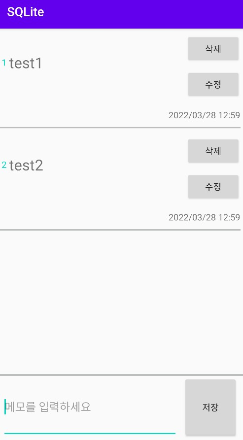
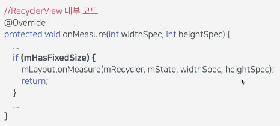
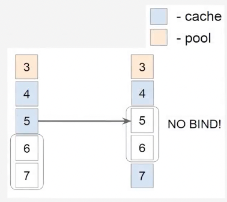
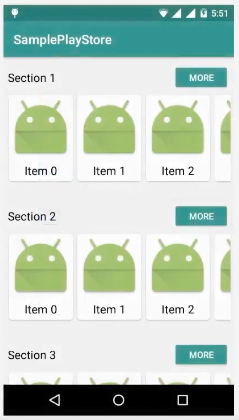
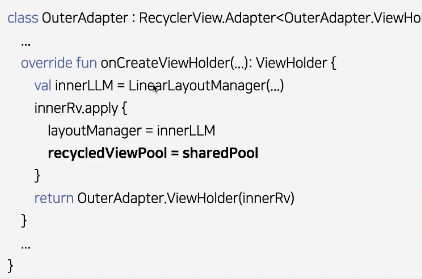
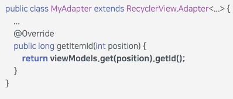

# Room + Singleton + Coroutine + ViewModel

---
RecyclerView 퍼포먼스 향상시키기 

1. <a href = "#content1">아이템 갱신 최소화하기</a> 
2. <a href = "#content2">DiffUtil 사용하기</a> 
3. <a href = "#content3">setHasFixedSize(true) 호출하기</a> 
4. <a href = "#content4">setItemViewCacheSize(int) 호출하기</a> 
5. <a href = "#content5">setRecycledViewPool(RecyclerViewPool) 호출하기</a> 
6. <a href = "#content6">setHasStableIds(true) 호출하기</a> 

* <a href = "#ref">참고링크</a>
---

><a id = "content1">**1. 아이템 갱신 최소화하기**</a> 

`Adapter.notifyDataSetChanged()`를 사용하여 전체를 갱신하는 대신 특정 아이템만 갱신하도록 한다. 

부분적으로 아이템을 갱신하는 메서드 
.notifyItemChanged 
.notifyItemInserted 
.notifyItemRemoved 
.notifyItemMoved 
.notifyItemRangeChanged 
.notifyItemRangeInserted 
.notifyItemRangeRemoved 

  

><a id = "content2">**2. DiffUtil 사용하기**</a> 

`DiffUtil` : 두 리스트의 차이를 계산하고 변경된 부분만 갱신하도록 도와주는 유틸클래스 

반드시 구현해야하는 DiffUtil.Callback 메소드 
.getOldListSize: 이전 리스트의 사이즈를 반환 
.getNewListSIze: 새로운 리스트의 사이즈를 반환 
.areItemsTheSame: 두 아이템이 같은지 검사한다. 
.areContentsTheSame: 두 아이템의 내용이 같은지 검사한다. 

  

><a id = "content3">**3. setHasFixedSize(true) 호출하기**</a> 

`RecyclerView.setHasFixedSize(true)`: Adapter 내용이 변경될 때 RecyclerView가 전체 레이아웃을 갱신하지 않도록 할 수 있다.

  

><a id = "content4">**4. setItemViewCacheSize(int) 호출하기**</a> 

`RecyclerView.setItemViewCacheSize(int n)`: 아이템 뷰가 Pool 로 들어가기 전에 유지되는 캐시의 사이즈를 결정한다.

  

><a id = "content5">**5. setRecycledViewPool(RecyclerViewPool) 호출하기**</a> 

`RecyclerView.setRecycledViewPool(RecyclerViewPool)`: 리사이클러뷰간 view pool을 공유하여 성능을 개선한다.

  

><a id = "content6">**6. setHasStableIds(true) 호출하기**</a> 

`Adapter.setHasStableIds(true)`: 아이템에 대해 고유 식별자를 부여하여 동일한 아이템에 대해 onBindViewHolder 호출을 방지하여 성능을 개선한다.

  

---

><a id = "ref">**참고링크**</a> 

-Room build version 
https://developer.android.com/jetpack/androidx/releases/room 

-Migration 클래스 
https://developer.android.com/training/data-storage/room/migrating-db-versions?hl=ko 

-Room Database 튜토리얼 + MVVM + Repository(with kotlin) 
https://thkim-study.tistory.com/15

-Create ViewModels with dependencies(viewModel Factory 참고 코드) 
https://developer.android.com/topic/libraries/architecture/viewmodel/viewmodel-factories

-안드로이드 Expandable RecyclerView 만들기 
https://android-dev.tistory.com/59

-[Android] RecyclerView Item Swipe 구현하기 (with Kotlin) 
https://velog.io/@jeongminji4490/Android-RecyclerView-Item-Swipe-%EA%B5%AC%ED%98%84%ED%95%98%EA%B8%B0-with-Kotlin

-RecyclerView 에서 item Swipe 하기 (feat. ItemTouchHelper, ItemTouchUIUtil) 
https://velog.io/@nimok97/RecyclerView-%EC%97%90%EC%84%9C-item-Swipe-%ED%95%98%EA%B8%B0-feat.-ItemTouchHelper-ItemTouchUIUtil

https://github.com/hanchang97/android_study/tree/master/selfStudy/Recyclerview/ItmTouchHelper2

